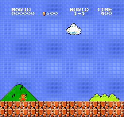
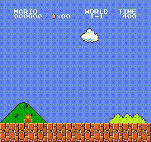
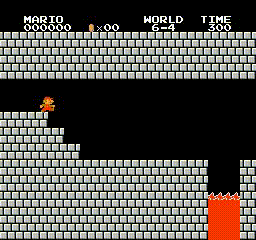
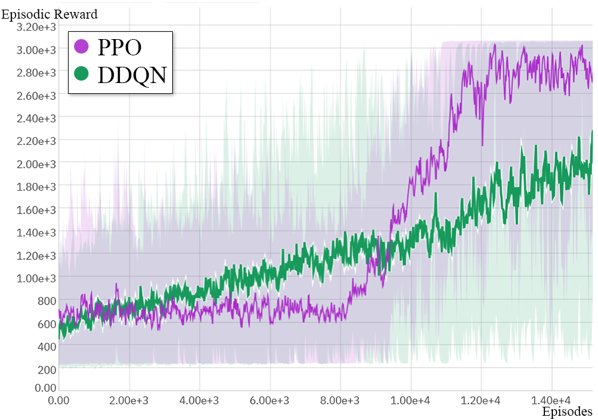
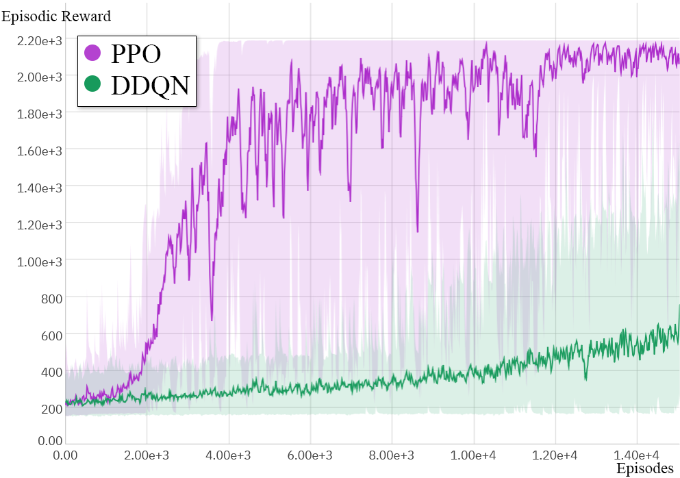
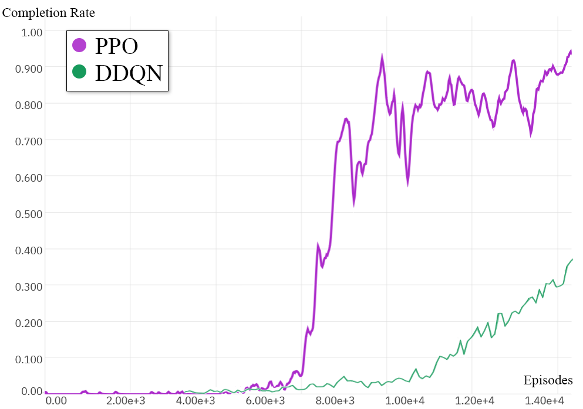
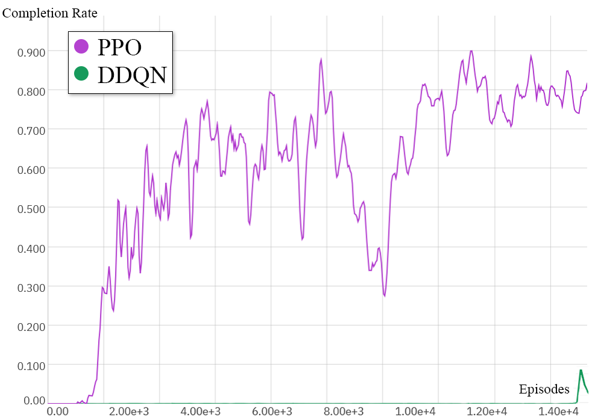

# IDATT2502 - Project Assignment 
- written by Daniel Skymoen, Edvard Schøyen, Jarand Romestrand, Kristian Vaula Jensen

## Assignment
### Various reinforcement learning tasks
#### Assignment proposals:
- Choose an environment - test different algorithms
- Choose an algorithm - test different environments
- Create an environment
- Explore different configurations of an algorithm
- Try a hardcore environment: MineRL, Atari, Doom​

We chose to try a hardcore environment, and the environment we ended up with was Super Mario Bros.

Read more about the environment here: https://pypi.org/project/gym-super-mario-bros/

## Problems statement
Compare the performence of DDQN and PPO in the Super Mario
Bros environment.

## Requirements
Here are the requirements to run the project:
- Python >=3.9, <3.12

Preferred requirements for easier setup and running of the project:
- Make

### Windows
- Visual Studio C++ build tools

## Help
To list all the Make commands use the command under:
```bash
make help
```

## How to run
The guide for running the project assumes that you have Make installed. If you don't have it, you will find the commands you need in the Makefile

### Setup
This function creates a virtual environment for all the dependecies required for running the project and installs them.

``` bash
make setup
```

Python3 is set to standard and if your computer uses python instead of python3 you can overwrite this with the command below:

```bash
make setup PYTHON=python
```

#### Neptun
An .env file is required to use Neptun for logging the training of a model.
This must be put inside the src folder.
Example of the contents needed for Neptun:
```bash
NEPTUNE_API_TOKEN="YOUR_API_KEY"
NEPTUNE_PROJECT_NAME="YOUR_NEPTUN_PROJECT_NAME"
```

### Running the project
The commands under activates the environment created in the setup section and then runs the python code.

#### Train the models
This function activates the environment and then trains the ddqn.

``` bash
make ddqn
```

This function activates the environment and then trains the ppo.

``` bash
make ppo
```

#### Render trained models
This function activates the environment and then renders a trained model of ddqn.
``` bash
make render-ddqn
```

This function activates the environment and then renders a trained model of ppo.
``` bash
make render-ppo
```

#### Options
You can specify flags for both the ppo and ddqn to log the training to Neptun.
You can use these args on both ppo and ddqn. The args can also be combined. 
To specify flags for logging use the commands under:

##### Log training
Logs the training to make graphs on Neptun
```bash
make ddqn args="--log"
```

##### Log the completed model
Logs the model to Neptun
```bash
make ddqn args="--log-model"
```

##### Log training and the completed model
Logs the training to make graphs and the model on Neptun
```bash
make ddqn args="--log --log-model"
```

##### Python options
Pyhton3 is set as standard so if your computer uses python instead of python3 you can overwrite this with the command below:

```bash
make ddqn PYTHON=python
```

#### Deactivate the environment with:
``` bash
deactivate
```

### Cleanup
This commands removes the virtual environment created in the setup section. You can also remove this manually.

```bash
make clean
```

## Example runs
Here are some example runs:

### DDQN
Example runs with DDQN:




### PPO
An example run with PPO:





## Performance graphs
Here are graphs of the models performance in the environment with 15 000 episodes:

### Reward per episode
#### Stage 1-1


#### Stage 6-4


### Completion rate/flag average the last 100 episodes
#### Stage 1-1


#### Stage 6-4

